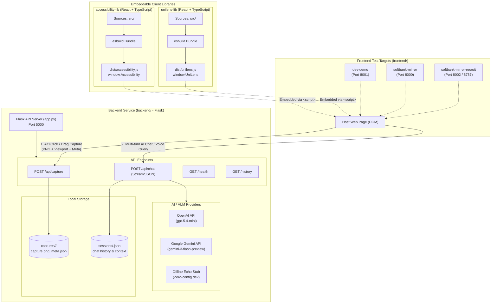
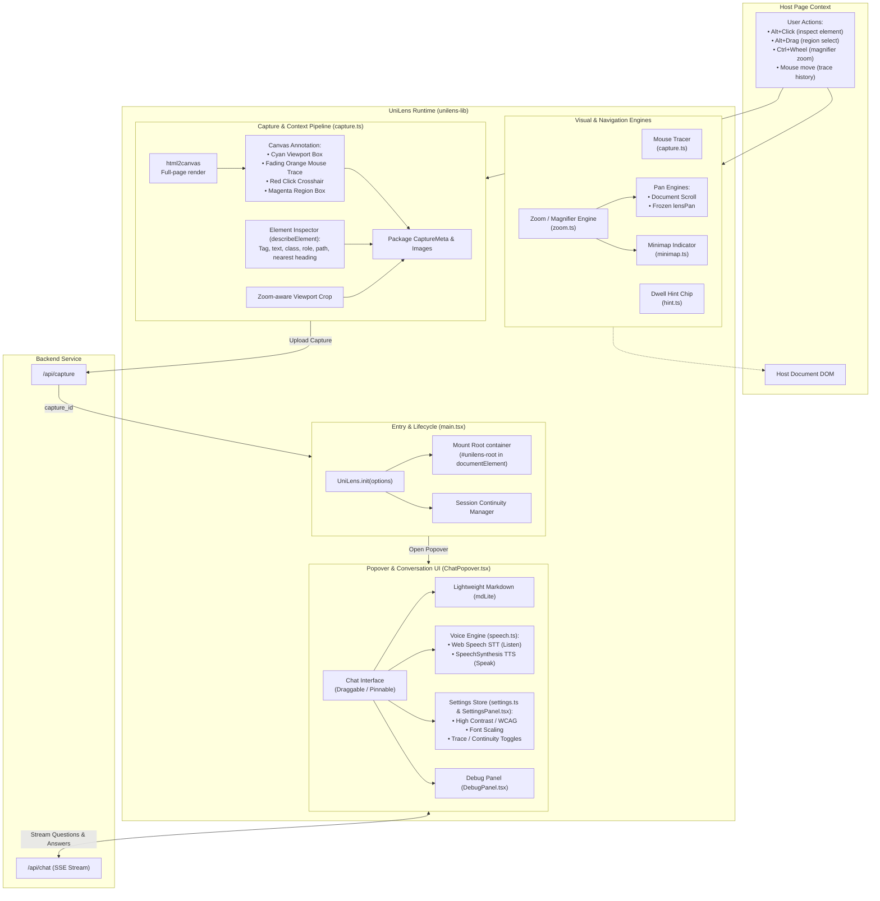

# Project Architecture

Describes the overall directory structure and high-level architecture of the project:

# Unilens Architecture

Describes the implementation architecture of the unilens library:
