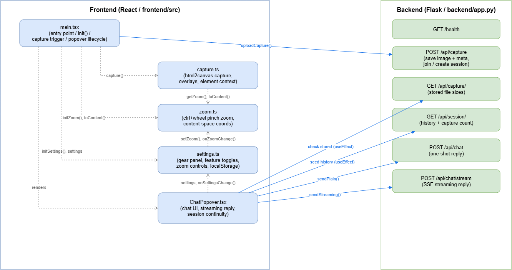

# UniLens Frontend Summary / UniLens フロントエンド要約



## 日本語

**概要**: どんなウェブページにも埋め込める、視覚的コンテキスト付きAIチャットのウィジェット。`<script>`タグ1本で`window.UniLens.init()`を呼ぶだけで動く埋め込み型ライブラリ(React + TypeScript + Vite、`frontend/src/main.tsx`)。

### 主要モジュール

- **`main.tsx`** — エントリポイント。Alt+クリック(またはAlt+ドラッグで範囲選択)をトリガーにキャプチャを実行し、バックエンドにアップロードしてチャットポップオーバーを開く。ポップオーバーはピン留め位置をlocalStorageに保存し、再読込後も同じ場所に復元。

- **`capture.ts`** — キャプチャの中核。`html2canvas`でページ全体をスクリーンショット化し、以下を重ねて描画:
  - クリック位置のクロスヘア
  - 直近のマウス軌跡(フェードするトレイル)
  - 現在のビューポート範囲(シアン枠)
  - Alt+ドラッグで選択した範囲(マゼンタ枠)

  加えて「今見えている部分」のクリーンな高解像度クローズアップも別途生成。`object-fit`画像はhtml2canvasの不具合を避けるため事前にcanvasへ焼き直す。クリックされたDOM要素の文脈(タグ、テキスト、role、直近の見出しなど)も収集。

- **`zoom.ts`** — Ctrl+ホイール(トラックパッドのピンチも含む)によるページ全体のピンチズーム。`document.body`に`scale()`を適用し、カーソル位置を基準にスクロール補正。ダブルクリックで要素にスマートズームする機能も。座標は常にズーム非依存の「content space」で記録され、非ズーム状態のスクリーンショットと整合する。

- **`ChatPopover.tsx`** — ドラッグ可能なチャットUI。キャプチャ画像を表示しつつ、バックエンド(`/api/chat`または`/api/chat/stream`)とやり取り。ストリーミング応答、会話の継続性(セッションID)、クイックアクション(「これを説明して」「要約して」「英訳して」)、ハイコントラストモードや文字サイズ調整など、アクセシビリティ寄りの設定に対応。

- **`settings.ts`** — 左下の歯車アイコンから開く設定パネル。各機能のON/OFFやキャプチャ解像度、チャット文字サイズなどをlocalStorageに永続化し、即座に反映。

## English

**Overview**: An embeddable AI chat widget that adds visual context to any web page. It's a drop-in library — a single `<script>` tag plus `window.UniLens.init()` — built with React + TypeScript + Vite (`frontend/src/main.tsx`).

### Key modules

- **`main.tsx`** — Entry point. Alt+click (or Alt+drag for a region selection) triggers a capture, uploads it to the backend, and opens the chat popover. The popover's pinned position is persisted to localStorage and restored across reloads.

- **`capture.ts`** — The core capture logic. Renders a full-page screenshot with `html2canvas` and overlays:
  - a crosshair at the click position
  - a fading trail of the recent mouse trace
  - the current viewport rectangle (cyan outline)
  - the Alt+drag-selected region (magenta outline)

  It also produces a separate clean, high-resolution close-up of what the user is currently viewing. `object-fit` images are pre-rendered onto canvases beforehand to work around an html2canvas limitation. It also collects context on the clicked DOM element (tag, text, role, nearest heading, etc.).

- **`zoom.ts`** — Pinch-style page zoom via Ctrl+wheel (including trackpad pinch gestures). Applies `scale()` to `document.body`, compensating scroll to keep the zoom anchored at the cursor. Also supports double-click "smart zoom" to fit an element. Coordinates are always recorded in a zoom-independent "content space" so they align with the unzoomed screenshot.

- **`ChatPopover.tsx`** — The draggable chat UI. Displays the capture image and talks to the backend (`/api/chat` or `/api/chat/stream`). Supports streaming replies, conversation continuity (session ID), quick-action chips ("Explain this," "Summarize," "→ English"), and accessibility-oriented settings like high-contrast mode and adjustable text size.

- **`settings.ts`** — The settings panel opened from the gear icon (bottom-left). Persists per-feature toggles, capture resolution, and chat font size to localStorage, applying changes live.


# React + TypeScript + Vite

This template provides a minimal setup to get React working in Vite with HMR and some Oxlint rules.

Currently, two official plugins are available:

- [@vitejs/plugin-react](https://github.com/vitejs/vite-plugin-react/blob/main/packages/plugin-react) uses [Oxc](https://oxc.rs)
- [@vitejs/plugin-react-swc](https://github.com/vitejs/vite-plugin-react/blob/main/packages/plugin-react-swc) uses [SWC](https://swc.rs/)

## React Compiler

The React Compiler is not enabled on this template because of its impact on dev & build performances. To add it, see [this documentation](https://react.dev/learn/react-compiler/installation).

## Expanding the Oxlint configuration

If you are developing a production application, we recommend enabling type-aware lint rules by installing `oxlint-tsgolint` and editing `.oxlintrc.json`:

```json
{
  "$schema": "./node_modules/oxlint/configuration_schema.json",
  "plugins": ["react", "typescript", "oxc"],
  "options": {
    "typeAware": true
  },
  "rules": {
    "react/rules-of-hooks": "error",
    "react/only-export-components": ["warn", { "allowConstantExport": true }]
  }
}
```

See the [Oxlint rules documentation](https://oxc.rs/docs/guide/usage/linter/rules) for the full list of rules and categories.
